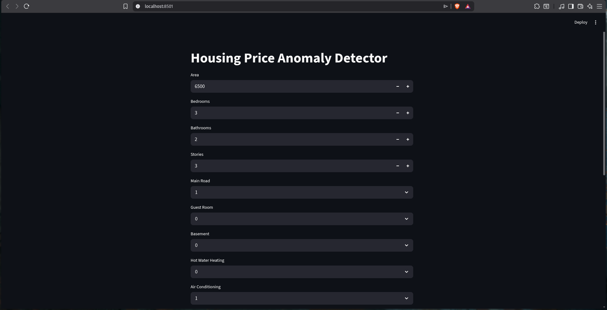
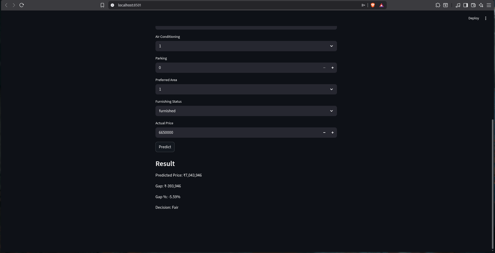

# Housing Price Anomaly Detector
An ML-based system that predicts house prices and classifies properties as fairly priced, underpriced, or overpriced. 
Based on a housing dataset sourced from Kaggle (https://www.kaggle.com/datasets/yasserh/housing-prices-dataset/data?select=Housing.csv)

## Problem Statement
It is designed for individuals or families who are looking to buy or rent housing properties and want a better understanding of pricing before making a decision.

## Data Insights

- Area and number of rooms show moderate correlation  
- Dataset exhibits non-linear relationships between features and price  
- Tree-based models performed better than linear models  
- Lack of location-based features limits overall prediction accuracy  

## Working
The system takes inputs such as area, number of rooms, bathrooms, stories, and other property features, along with the actual listed price of the property.
Based on this, the model predicts an expected fair price using historical housing data, and then compares it with the actual listing price to classify the property as fairly priced, slightly/strongly overpriced, or slightly/strongly underpriced.
1. Takes property features (area, rooms, etc.) + listing price  
2. Predicts expected price using a trained ML model  
3. Compares predicted vs actual price  
4. Classifies property as:
   - fair
   - slightly/strongly underpriced
   - slightly/strongly overpriced

## Application Preview

### Input Interface


### Output Result


## Features
- Price prediction using Linear Regression (Baseline Model)  
- Cross-validation for model evaluation  
- RMSE-based threshold for decision making  
- Percentage-based intensity classification  
- Interpretable outputs (price gap and % difference)

## Tech Stack
- Python
- NumPy, Pandas
- scikit-learn

## Models Used

- Linear Regression (Baseline)  
- Random Forest Regressor  
- XGBoost Regressor (Final Model)

The final system uses a tuned XGBoost model due to better generalization performance and reduced overfitting compared to other models.

## How to Run

Clone the repository and run the application:

```bash
git clone https://github.com/kirmada67-dot/housing-price-anomaly-detector
cd housing-price-anomaly-detector
pip install -r requirements.txt
streamlit run app.py
```

## Changelog

### v3.0 – Application Layer + System Architecture (current)

- Restructured project into a clean modular format (`train.py`, `predict.py`, `app.py`)
- Built a reusable inference pipeline (`predict.py`)
- Added feature order enforcement to prevent incorrect predictions
- Integrated trained model into a working Streamlit application
- Implemented full input → prediction → decision flow in UI
- Added support for real-time property evaluation through web interface
- Organized dataset and models into separate directories (`data/`, `model/`)
- Saved multiple models (Linear Regression, Random Forest, XGBoost) for future use
- Improved overall project readability and maintainability

### v2.0 - Model Improvement

- Replaced Linear Regression with tuned XGBoost model
- Reduced overfitting using lower learning rate and shallow trees
- Improved generalization performance (better test R²)
- Compared multiple models:
  - Linear Regression
  - Random Forest
  - XGBoost
- Selected final model based on cross-validation and test performance
- Integrated improved model into anomaly detection system

### v1.0 - Baseline Model 
- Implemented Linear Regression for price prediction
- Applied cross-validation to evaluate model performance
- Built RMSE-based threshold for pricing decisions
- Classified properties as fair, underpriced, or overpriced
- Added percentage-based intensity (slightly / strongly)


